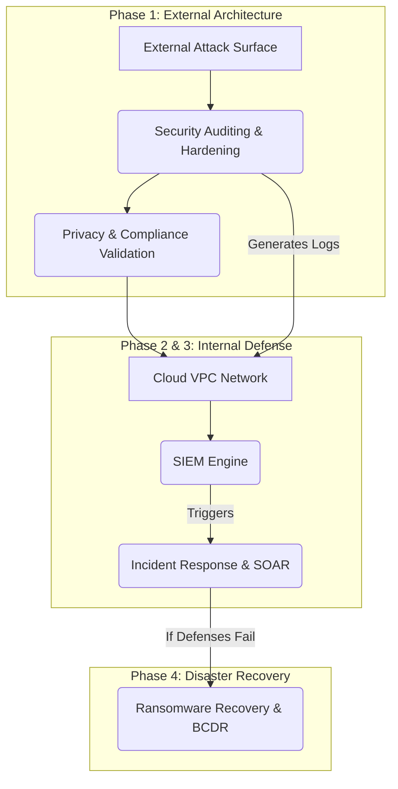

# Enterprise Cloud SecOps Architecture


## Quick Navigation
- [Executive Summary](#executive-summary)
- [System Architecture](#system-architecture)
- [Repository Structure](#repository-structure)
- [Key Infrastructure Findings](#key-infrastructure-findings)
- [Core Components](#core-components)

---

## Executive Summary
> **Author:** Ziad Alex  
> **Profile:** [https://qabilah.com/profile/ziadalex2003/](https://qabilah.com/profile/ziadalex2003/)  
> **Domain:** Security Operations (SecOps) & Cloud Security Architecture  
> **Target Environment:** Ghaymah Managed Cloud Services (`ghaymah.systems`, `mithal.space`)

This repository showcases a comprehensive, end-to-end Security Operations (SecOps) implementation for cloud-native infrastructure (Kubernetes + Block Storage). The project demonstrates advanced security engineering capabilities spanning offensive infrastructure auditing, defensive detection engineering, privacy compliance, and automated incident response.

The architecture is divided into five core operational domains:
1. **Security Audit & Hardening:** Automated bash scripts for port enumeration, TLS validation, and IAM permissions audits against production cloud nodes.
2. **Incident Response (SOAR):** A fully documented PICERL mitigation strategy integrating Wazuh rules and automated playbooks to thwart brute-force attacks and data exfiltration.
3. **Privacy & Compliance Validation:** Dynamic analysis of web properties ensuring zero-cookie tracking and HTTP security header enforcement (HSTS/CSP).
4. **Custom SIEM Engineering:** A Python-based Security Information and Event Management (SIEM) engine featuring real-time log parsing and a live HTML/JS web dashboard.
5. **Disaster Recovery (Ransomware):** Strategic backup architectures leveraging immutable, air-gapped block storage to guarantee a 4-hour RPO and 2-hour RTO.

---

## System Architecture



---

## Repository Structure

```text
Ghaymah-SecOps-Portfolio/
├── README.md                              ← You are here
├── docs/                                  # Master Indices & Architecture Guides
│   ├── evidence-index.md
│   ├── findings-summary.md
│   └── sample-output.md
│
├── security-audit/                        # Bash automation & compliance
│   ├── ghaymah_audit.sh
│   └── security_checklist.md
│
├── incident-response/                     # PICERL, Kill Chain & Wazuh
│   ├── incident_response_plan_PICERL.md
│   ├── kill_chain_timeline.md
│   ├── prevention_architecture.md
│   ├── wazuh_brute_force_rules.xml
│   └── wazuh_rules_explained.md
│
├── privacy-architecture/                    # Browser DevTools dynamic analysis
│   └── privacy_architecture_report.md
│
├── siem-engine/                           # Custom Python SIEM Engine
│   ├── siem_engine.py
│   ├── siem_detection_rules.md
│   └── dashboard/                         # ★ LIVE HTML/CSS/JS DASHBOARD ★
│       ├── index.html
│       ├── style.css
│       └── app.js
│
└── disaster-recovery/                     # DR, Backups & Recovery Strategy
    └── ransomware_response_plan.md
```

---

## Key Infrastructure Findings

| Domain | Finding | Severity | Evidence |
|------|----------|----------|----------|
| **Audit** | SSH (Port 22) Exposed | WARNING | `ghaymah_audit.png` |
| **Audit** | Content-Security-Policy (CSP) Missing | WARNING | `ghaymah_audit.png` |
| **Privacy** | Missing HSTS Header | HIGH | `network_headers.png` |
| **Privacy** | Analytics Tracking Scripts (Client-side) | MEDIUM | `network-overview.png` |
| **SIEM** | In-Memory State Exhaustion | CRITICAL | Architecture Review |

> [!NOTE]
> For a full list of findings and remediation recommendations across the infrastructure, see [docs/findings-summary.md](docs/findings-summary.md).

---

## Security Controls Implemented
- **Automated Hardening:** Fast, targeted bash scripts replacing bloated OS checks.
- **Zero-Trust NetworkPolicies:** Segmented K8s architecture preventing lateral movement.
- **Tiered Detections:** Mathematical thresholds in Wazuh preventing alert fatigue.
- **Immutable Recovery:** WORM storage strategies mitigating ransomware encryption.

---

## Screenshots Gallery
All evidence and telemetry data are embedded directly into the module documentation. Use the links below to view the visual evidence:
- **Audit:** [Audit Script Execution](security-audit/security_checklist.md#evidence-security-audit-execution)
- **Privacy:** [TLS Certificate Verification](privacy-architecture/privacy_architecture_report.md#evidence)
- **Privacy:** [Missing Security Headers](privacy-architecture/privacy_architecture_report.md#evidence)
- **SIEM:** [SIEM Dashboard UI](siem-engine/siem_deployment_architecture.md#screenshots)
- **SIEM:** [Real-time SIEM Alerts](siem-engine/siem_deployment_architecture.md#screenshots)

*(For a master list of all evidence, see [docs/evidence-index.md](docs/evidence-index.md)).*
