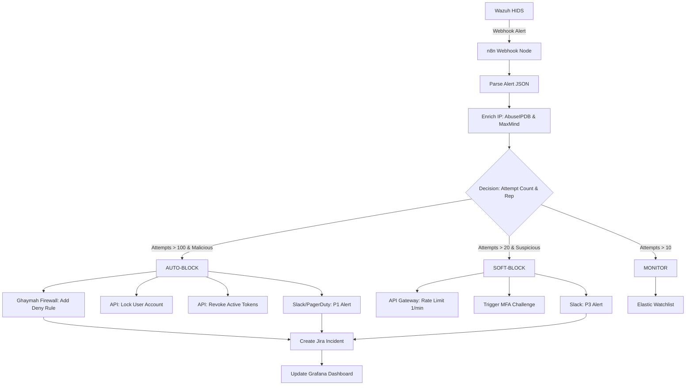

# Incident Response Plan (PICERL Framework)
## Ghaymah Cloud — API Brute Force & Data Exfiltration Response

> **Document ID:** GH-IRP-2026-001  
> **Classification:** CONFIDENTIAL  
> **Framework:** NIST SP 800-61 Rev. 3 / PICERL  
> **SOAR Platform:** n8n (Self-hosted on Ghaymah Kubernetes)

### Framework Mapping
- **MITRE ATT&CK:** Initial Access (T1110 Brute Force) → Persistence (T1053 Scheduled Task) → Credential Access (T1040 Network Sniffing) → Exfiltration (T1567 Exfiltration Over Web Service).
- **Cyber Kill Chain:** 
  1. *Reconnaissance:* Scanning external Ghaymah endpoints.
  2. *Delivery/Exploitation:* Automated brute force against the API gateway.
  3. *Installation:* Deploying a malicious CronJob in the K8s cluster.
  4. *Command & Control:* Polling C2 via disguised HTTPS traffic.
  5. *Actions on Objectives:* Copying Ghaymah Block Storage volumes and exfiltrating.

---

## Phase 1: Preparation

### 1.1 Team Roles & Escalation Matrix

| Role | Responsibility | Escalation Trigger |
|------|---------------|--------------------|
| **SOC Analyst L1** | Triage Wazuh alerts, validate true positives | >50 failed logins/min from same target account |
| **SOC Analyst L2** | Deep investigation, IOC extraction, containment | Confirmed brute force with credential compromise |
| **Incident Commander** | Coordinate response, manage communications | Any confirmed data exfiltration |
| **Ghaymah Platform Team** | Infrastructure-level containment, network isolation | Container escape or control plane compromise |
| **Legal/DPO** | Regulatory notification architecture | PII/PHI data confirmed exfiltrated |

### 1.2 Pre-Deployed Tools & Infrastructure

| Tool | Purpose | Deployment |
|------|---------|------------|
| **Wazuh** | HIDS/NIDS, log aggregation, rule-based detection | DaemonSet on all K8s nodes + dedicated manager |
| **n8n** | SOAR orchestration, automated playbook execution | Self-hosted pod in `security-tools` namespace |
| **Elastic Stack** | Log storage, search, visualization (Kibana) | Managed cluster on Ghaymah Block Storage |
| **Velero** | Kubernetes backup & disaster recovery | CronJob with Block Storage snapshots |
| **Falco** | Runtime container security monitoring | DaemonSet with custom rules |

### 1.3 n8n SOAR Playbook — Pre-Built Automations

#### Architecture Workflow Diagram



#### Playbook: `brute-force-auto-response`
```
Trigger: Wazuh webhook → n8n (HTTP POST to /webhook/brute-force)

Workflow Steps:
1. [Wazuh Webhook] → Receive alert JSON payload
2. [Parse Alert] → Extract: source_ip, target_account, attempt_count, timestamp
3. [Enrich IP] → Query AbuseIPDB + VirusTotal + MaxMind GeoIP
4. [Decision Node] → 
   ├── IF attempts > 100 AND ip_reputation = "malicious" → AUTO-BLOCK
   │   ├── [Block IP] → POST to Ghaymah firewall API: add deny rule
   │   ├── [Disable Account] → PATCH /api/v1/users/{id}/status → "locked"
   │   ├── [Revoke Tokens] → DELETE /api/v1/auth/tokens?user={id}
   │   └── [Notify] → Slack #soc-alerts + PagerDuty (P1 if service account)
   │
   ├── IF attempts > 20 AND ip_reputation = "suspicious" → SOFT-BLOCK
   │   ├── [Rate Limit] → Apply 1 req/min rate limit to source IP
   │   ├── [Force MFA] → Trigger MFA challenge on target account
   │   └── [Notify] → Slack #soc-alerts (P3)
   │
   └── IF attempts > 10 → MONITOR
       ├── [Add to Watchlist] → Update Elastic watchlist index
       └── [Log] → Enrich and store in security-incidents index
5. [Create Ticket] → Auto-create Jira/ServiceNow incident ticket
6. [Update Dashboard] → Push metrics to Grafana security dashboard
```

#### n8n Workflow JSON (Core Logic):
```json
{
  "name": "Brute Force Auto-Response",
  "nodes": [
    {
      "name": "Wazuh Webhook",
      "type": "n8n-nodes-base.webhook",
      "parameters": {
        "httpMethod": "POST",
        "path": "brute-force",
        "authentication": "headerAuth",
        "headerAuth": { "name": "X-Webhook-Secret", "value": "={{$env.WEBHOOK_SECRET}}" }
      }
    },
    {
      "name": "Parse Alert",
      "type": "n8n-nodes-base.set",
      "parameters": {
        "values": {
          "string": [
            { "name": "source_ip", "value": "={{$json.data.srcip}}" },
            { "name": "target_user", "value": "={{$json.data.dstuser}}" },
            { "name": "rule_id", "value": "={{$json.rule.id}}" }
          ],
          "number": [
            { "name": "attempt_count", "value": "={{$json.data.attempt_count}}" }
          ]
        }
      }
    },
    {
      "name": "Enrich IP - AbuseIPDB",
      "type": "n8n-nodes-base.httpRequest",
      "parameters": {
        "url": "https://api.abuseipdb.com/api/v2/check",
        "method": "GET",
        "queryParameters": { "ipAddress": "={{$node['Parse Alert'].json.source_ip}}", "maxAgeInDays": "90" },
        "headerParameters": { "Key": "={{$env.ABUSEIPDB_API_KEY}}", "Accept": "application/json" }
      }
    },
    {
      "name": "Decision - Severity",
      "type": "n8n-nodes-base.if",
      "parameters": {
        "conditions": {
          "number": [{ "value1": "={{$node['Parse Alert'].json.attempt_count}}", "operation": "largerEqual", "value2": 100 }]
        }
      }
    },
    {
      "name": "Block IP - Ghaymah Firewall",
      "type": "n8n-nodes-base.httpRequest",
      "parameters": {
        "url": "https://api.ghaymah.systems/v1/firewall/rules",
        "method": "POST",
        "body": {
          "action": "deny",
          "source_ip": "={{$node['Parse Alert'].json.source_ip}}",
          "protocol": "tcp",
          "ports": ["443", "80"],
          "ttl": 86400,
          "reason": "Automated block - brute force detection (n8n playbook)"
        },
        "authentication": "oAuth2",
        "oAuth2Api": "ghaymahApi"
      }
    },
    {
      "name": "Lock Account",
      "type": "n8n-nodes-base.httpRequest",
      "parameters": {
        "url": "https://api.ghaymah.systems/v1/iam/users/={{$node['Parse Alert'].json.target_user}}/lock",
        "method": "POST",
        "body": {
          "reason": "Account targeted in brute force attack - locked pending investigation",
          "locked_by": "n8n-soar-automation"
        }
      }
    },
    {
      "name": "Slack Notification",
      "type": "n8n-nodes-base.slack",
      "parameters": {
        "channel": "#soc-alerts",
        "text": "🚨 *BRUTE FORCE AUTO-RESPONSE TRIGGERED*\n• Source IP: `={{$node['Parse Alert'].json.source_ip}}`\n• Target: `={{$node['Parse Alert'].json.target_user}}`\n• Attempts: `={{$node['Parse Alert'].json.attempt_count}}`\n• Action: IP Blocked + Account Locked\n• AbuseIPDB Score: `={{$node['Enrich IP - AbuseIPDB'].json.data.abuseConfidenceScore}}%`"
      }
    }
  ]
}
```

---

## Phase 2: Identification

### 2.1 Detection Sources

| Source | Alert Type | Threshold |
|--------|-----------|-----------|
| **Wazuh Rule 100201** | API brute force detection | >10 failed logins in 60s per target |
| **Wazuh Rule 100202** | Impossible travel login | Auth from 2 geolocations <1hr apart |
| **Elastic ML** | Anomalous authentication volume | 3σ deviation from baseline |
| **Falco** | Unexpected exec in database pod | Any `exec` in `postgres-*` pods |
| **K8s Audit Logs** | Secret access from unusual SA | SA accessing secrets outside its namespace |

### 2.2 Triage Procedure & Evidence Collection

**Evidence Collection (Chain of Custody):**
1. **Memory:** If the pod is still running, capture a memory dump before killing it: `kubectl debug -it <pod> --target=<container> --image=busybox -- sh -c "cat /proc/kcore > /mnt/ebs/memory_dump.img"`
2. **Logs:** Export all K8s API audit logs, ingress logs, and Wazuh HIDS logs for the past 7 days related to the targeted account.
3. **Snapshots:** Take immediate forensic snapshots of any associated Block Storage volumes. Do NOT mount these snapshots on active clusters.

**Decision Point:** 
- If brute force is *unsuccessful*: Monitor and tune WAF rules.
- If brute force is *successful* (credential compromised): Move to Containment Phase immediately.

**Triage Steps:**
1. Validate alert is true positive (check for known scan/pentest windows).
2. Determine blast radius: which accounts, namespaces, and data stores are affected.
3. Classify severity using Ghaymah incident severity matrix.
4. Assign Incident Commander if severity ≥ P2.

**Communication:**
- **SOC L1 to L2:** Escalate via Jira ticket with attached Wazuh JSON alert.
- **L2 to IC:** Escalate via PagerDuty for any P1/P2 incidents.

---

## Phase 3: Containment

### 3.1 Immediate Containment (First 15 Minutes) — Automated via n8n

| Action | Method | Automated? |
|--------|--------|------------|
| Block attacker IPs at firewall | n8n → Ghaymah Firewall API | ✅ Yes |
| Lock compromised accounts | n8n → IAM API | ✅ Yes |
| Revoke all active tokens for affected accounts | n8n → Token Revocation API | ✅ Yes |
| Kill rogue K8s workloads | `kubectl delete cronjob sync-external-v2 -n data-pipeline` | Manual (L2) |
| Network-isolate affected namespace | Apply deny-all NetworkPolicy to `data-pipeline` | Manual (L2) |

**Decision Point: Hard vs. Soft Isolation**
- *Soft Isolation:* Rate-limit IPs and force MFA. Used when confident the attacker has not gained internal execution (Phase 1-4).
- *Hard Isolation:* Disconnect external routing entirely (deny-all NetworkPolicy) and kill pods. Used when lateral movement or exfiltration is detected (Phase 5-8).
- **Containment Strategy Justification:** Hard isolation (NetworkPolicy) is prioritized over killing the pod initially because killing the pod destroys volatile memory. Applying a default-deny NetworkPolicy stops lateral movement and exfiltration immediately while preserving the container environment for memory forensics.

**Communication:**
- Notify Engineering Leads that `data-pipeline` namespace is temporarily isolated.
- Update internal status page: "Investigating degraded performance on Data Pipeline API."

### 3.2 Short-Term Containment (15-60 Minutes)

```bash
# 1. Isolate affected namespace with deny-all network policy
kubectl apply -f - <<EOF
apiVersion: networking.k8s.io/v1
kind: NetworkPolicy
metadata:
  name: emergency-isolate
  namespace: data-pipeline
spec:
  podSelector: {}
  policyTypes:
  - Ingress
  - Egress
EOF

# 2. Rotate all secrets in affected namespace
kubectl get secrets -n data-pipeline -o name | xargs -I {} kubectl delete {} -n data-pipeline

# 3. Force-rotate database credentials
kubectl exec -it postgres-primary-0 -n data-pipeline -- psql -c \
  "ALTER USER app_user WITH PASSWORD 'NEW_SECURE_PASSWORD_FROM_VAULT';"

# 4. Snapshot affected Block Storage volumes for forensics
ghaymah block-storage snapshot create \
  --volume-id vol-data-pipeline-pvc-xxx \
  --name "forensic-snapshot-$(date +%Y%m%d)" \
  --tags "incident=GH-IR-2026-0042,type=forensic"
```

### 3.3 Long-Term Containment
- Rebuild affected pods from known-good images (pull from verified, signed registry).
- Deploy updated NetworkPolicies with explicit allow-list (zero-trust).
- Enable enhanced audit logging on all API endpoints.

---

## Phase 4: Eradication

### 4.1 Eradication Checklist
- [ ] Remove all attacker-created accounts (`svc-monitoring-ext`).
- [ ] Delete all attacker-generated API tokens.
- [ ] Remove rogue CronJob (`sync-external-v2`) and any associated ConfigMaps/Secrets.
- [ ] Scan all container images in the cluster for backdoors (Trivy full scan).
- [ ] Reset and rotate ALL service account tokens in affected namespaces.
- [ ] Block all identified C2 domains/IPs at DNS and firewall level.
- [ ] Verify no additional persistence mechanisms (check init containers, volume mounts, admission webhooks).

### 4.2 IOC Blocklist Update
```bash
# Push IOCs to Wazuh CDB lists for ongoing detection
cat >> /var/ossec/etc/lists/blocked_ips <<EOF
45.142.xxx.xxx:Brute-force-GH-IR-2026-0042
EOF

cat >> /var/ossec/etc/lists/blocked_domains <<EOF
cdn-static.xyz:C2-GH-IR-2026-0042
storage.cdn-static.xyz:Exfil-GH-IR-2026-0042
EOF

# Restart Wazuh manager to load updated lists
systemctl restart wazuh-manager
```

---

## Phase 5: Recovery

### 5.1 Recovery Steps
1. Restore database from last known-good backup (pre-compromise snapshot).
2. Verify data integrity via checksum comparison.
3. Gradually re-enable services with enhanced monitoring.
4. Implement all prevention controls before full restoration (MFA, rate limiting, NetworkPolicies).
5. Conduct a validation penetration test before declaring recovery complete.

### 5.2 Monitoring Posture (Post-Recovery)
- Increase Wazuh alert sensitivity for 30 days.
- Enable real-time K8s audit log streaming to Elastic.
- Deploy honeypot service account to detect re-compromise attempts.

---

## Phase 6: Lessons Learned

### 6.1 Post-Incident Review Meeting
- **When:** Within 5 business days of incident closure.
- **Attendees:** SOC team, Platform team, Engineering leads, CISO.
- **Deliverables:** Root cause analysis, updated threat model, remediation tracking.

### 6.2 Identified Gaps & Remediation

| Gap | Impact | Remediation | Owner | Deadline |
|-----|--------|-------------|-------|----------|
| No MFA on service accounts | Direct cause of compromise | Enforce MFA on ALL accounts | IAM Team | 2 weeks |
| Per-IP rate limiting only | Distributed attack bypassed | Implement per-account + global rate limiting | API Team | 1 week |
| No impossible-travel detection | Late detection of anomalous login | Deploy Wazuh GeoIP correlation rules | SOC Team | 2 weeks |
| Overly permissive ClusterRoleBinding | Enabled lateral movement | Audit and scope-reduce all RBAC bindings | Platform | 3 weeks |
| No egress monitoring | Exfiltration undetected for hours | Deploy DLP + egress NetworkPolicies | Security | 2 weeks |
| Long-lived API tokens allowed | Persistence mechanism | Enforce max 24hr token expiry + rotation | IAM Team | 1 week |

### 6.3 Updated Playbooks
- Update n8n `brute-force-auto-response` to include per-account rate limiting triggers.
- Create new n8n playbook: `impossible-travel-response`.
- Create new n8n playbook: `egress-anomaly-response`.


