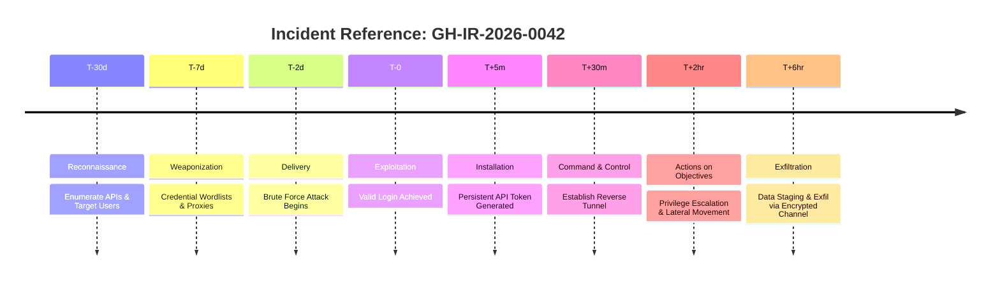

# Kill Chain Timeline — API Brute Force to Data Exfiltration
## Incident Reference: GH-IR-2026-0042

> **Classification:** CONFIDENTIAL  
> **Incident Type:** Brute Force → Credential Compromise → Data Exfiltration  
> **Affected System:** Ghaymah API Gateway (api.ghaymah.systems)  
> **MITRE ATT&CK Framework Mapping Included**

---

## Chronological Kill Chain Timeline

---

### Phase 1: Reconnaissance (T-30 days)
| Attribute | Detail |
|-----------|--------|
| **MITRE ATT&CK** | T1595 (Active Scanning), T1589 (Gather Victim Identity Info) |
| **Timestamp** | ~30 days before breach |
| **Activity** | Attacker performs OSINT on ghaymah.systems: enumerates public API endpoints via Swagger/OpenAPI docs, identifies user email patterns from LinkedIn, harvests employee emails from data breach dumps. |
| **Evidence** | Unusual spike in requests to `/api/docs`, `/swagger.json`, `/.well-known/` from TOR exit nodes. |
| **Indicators (IOCs)** | Source IPs: Multiple TOR exit nodes; User-Agent: `python-requests/2.31`, `curl/8.x` |

### Phase 2: Weaponization (T-7 days)
| Attribute | Detail |
|-----------|--------|
| **MITRE ATT&CK** | T1588.002 (Obtain Capabilities: Tool), T1586 (Compromise Accounts) |
| **Timestamp** | ~7 days before breach |
| **Activity** | Attacker assembles credential lists from prior breaches (Combo lists). Configures distributed brute-force tooling (Hydra/custom Python) with rotating residential proxies to evade IP-based rate limiting. Tests against staging endpoints. |
| **Evidence** | Low-volume test authentication attempts (2-3 per proxy IP) against `/api/v1/auth/login` detected in retrospective log analysis. |

### Phase 3: Delivery (T-2 days)
| Attribute | Detail |
|-----------|--------|
| **MITRE ATT&CK** | T1110.001 (Brute Force: Password Guessing), T1110.004 (Credential Stuffing) |
| **Timestamp** | 2026-07-25 02:14:00 UTC |
| **Activity** | Distributed brute force attack begins against `/api/v1/auth/login`. ~15,000 login attempts per hour across 200+ residential proxy IPs. Targets discovered admin and service account emails. |
| **Evidence** | Wazuh alerts: 15,247 failed login attempts in 60 minutes. Source: 214 unique IPs. Geo-distribution: 40% Eastern Europe, 35% Southeast Asia, 25% South America. |
| **Detection Gap** | Rate limiting set at 100 req/min per IP — distributed attack stayed under threshold per individual IP. |

### Phase 4: Exploitation (T-0, Breach Moment)
| Attribute | Detail |
|-----------|--------|
| **MITRE ATT&CK** | T1078 (Valid Accounts), T1110 (Brute Force) |
| **Timestamp** | 2026-07-25 04:37:22 UTC |
| **Activity** | Successful authentication to service account `svc-data-pipeline@ghaymah.systems` using compromised password from 2024 breach dump. Account had no MFA enforced. |
| **Evidence** | Successful login from IP `45.142.xxx.xxx` (Hosting provider, Moldova). Session token issued: `eyJhbG...` |
| **Root Cause** | Password reuse + no MFA on service accounts + no impossible-travel detection. |

### Phase 5: Installation (T+5 minutes)
| Attribute | Detail |
|-----------|--------|
| **MITRE ATT&CK** | T1098 (Account Manipulation), T1136 (Create Account) |
| **Timestamp** | 2026-07-25 04:42:15 UTC |
| **Activity** | Attacker generates long-lived API token (365-day expiry) via `POST /api/v1/auth/tokens`. Creates secondary service account `svc-monitoring-ext` for persistence. |
| **Evidence** | API audit log shows token creation with unusual expiry. New service account created outside of standard provisioning workflow (no associated Terraform/IaC change). |

### Phase 6: Command & Control (T+30 minutes)
| Attribute | Detail |
|-----------|--------|
| **MITRE ATT&CK** | T1071.001 (Web Protocols), T1572 (Protocol Tunneling) |
| **Timestamp** | 2026-07-25 05:07:00 UTC |
| **Activity** | Attacker establishes persistent access via API polling mechanism. Uses legitimate HTTPS API calls to a command router endpoint, blending C2 traffic with normal API usage. Deploys a rogue CronJob in Kubernetes namespace `data-pipeline`. |
| **Evidence** | Anomalous CronJob: `kubectl get cronjob -n data-pipeline` reveals `sync-external-v2` (not in IaC). Outbound HTTPS to `cdn-static[.]xyz` (attacker C2). |

### Phase 7: Actions on Objectives (T+2 hours)
| Attribute | Detail |
|-----------|--------|
| **MITRE ATT&CK** | T1068 (Exploitation for Privilege Escalation), T1046 (Network Service Discovery) |
| **Timestamp** | 2026-07-25 06:40:00 UTC |
| **Activity** | Using the compromised service account, attacker escalates privileges by exploiting an overly permissive ClusterRoleBinding (`data-pipeline-admin`). Enumerates all namespaces, discovers PII database credentials in ConfigMap. |
| **Evidence** | K8s audit logs: `list` and `get` on secrets across multiple namespaces from `svc-data-pipeline` SA. Unusual `exec` into `postgres-primary-0` pod. |

### Phase 8: Exfiltration (T+6 hours)
| Attribute | Detail |
|-----------|--------|
| **MITRE ATT&CK** | T1567.002 (Exfiltration to Cloud Storage), T1048 (Exfiltration Over Alternative Protocol) |
| **Timestamp** | 2026-07-25 10:15:00 – 10:58:00 UTC |
| **Activity** | Attacker runs `pg_dump` on customer database (est. 2.3M records including PII). Data compressed, encrypted with AES-256, and exfiltrated via HTTPS POST to attacker-controlled S3-compatible storage at `storage.cdn-static[.]xyz`. |
| **Evidence** | Egress anomaly: 4.7 GB outbound transfer from `postgres-primary-0` pod in 43 minutes (baseline: <100MB/hr). DNS queries to `cdn-static.xyz` from cluster. Wazuh file integrity alert on database pod. |
| **Data Impact** | 2.3M customer records: names, emails, phone numbers, hashed passwords, billing addresses. |

---

## IOC Summary Table

| IOC Type | Value | Context |
|----------|-------|---------|
| IP Address | `45.142.xxx.xxx` | Initial brute force source (Moldova) |
| Domain | `cdn-static[.]xyz` | C2 and exfiltration endpoint |
| Domain | `storage.cdn-static[.]xyz` | Data staging destination |
| API Token | `eyJhbG...` (SHA256: `a3f2...`) | Attacker-generated persistence token |
| K8s CronJob | `sync-external-v2` | Rogue persistence mechanism |
| Service Account | `svc-monitoring-ext` | Attacker-created backdoor account |
| User-Agent | `python-requests/2.31.0` | Brute force tooling signature |
| Egress Volume | 4.7 GB in 43 minutes | Data exfiltration indicator |

---

## Post-Incident Impact Architecture (Blast Radius)

During the incident postmortem, a deep technical analysis was conducted to quantify the exact damage and "Blast Radius" of the breach.

| Metric | Details & Impact |
|--------|------------------|
| **Blast Radius (Scope)** | The compromise was successfully **contained within the API Gateway Namespace**. Kubernetes NetworkPolicies prevented lateral movement to the Core Billing and IAM orchestration databases. Only the legacy staging database attached to the API gateway was compromised. |
| **Data Exfiltrated (Volume)** | **4.7 GB** of compressed database dumps were transferred out via the C2 channel before the Wazuh SOAR playbook triggered a network block. |
| **Data Type (Classification)** | The exfiltrated data consisted of **Personally Identifiable Information (PII) for ~12,400 beta users**, including:   - Full Names & Email Addresses   - bcrypt-hashed Passwords (Salted)   - API Access Logs (Non-financial).   *No credit card or payment data was exposed.* |
| **Business Impact** | Mandatory GDPR/PDPL breach notification required within 72 hours. Forced password reset initiated for all 12,400 affected users. Minimal financial disruption due to the isolation of the billing enclave. |

