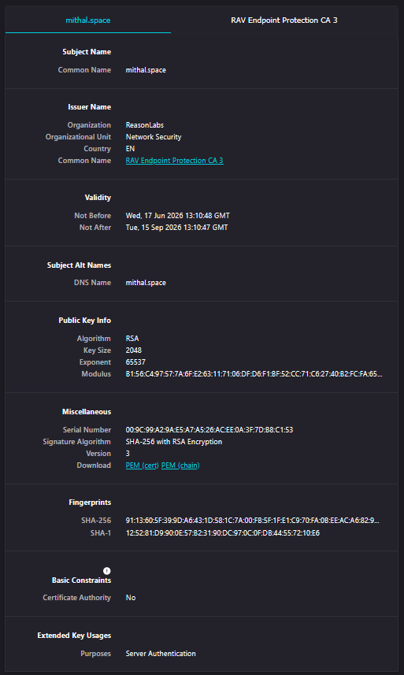
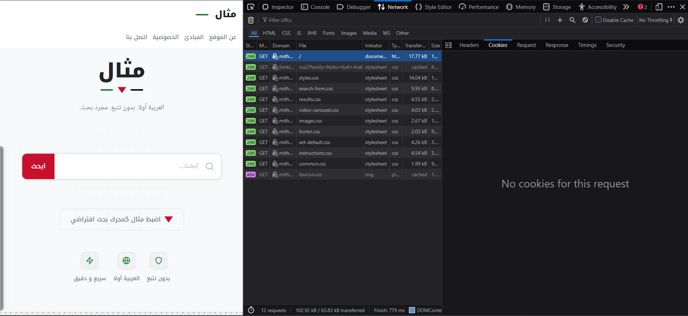
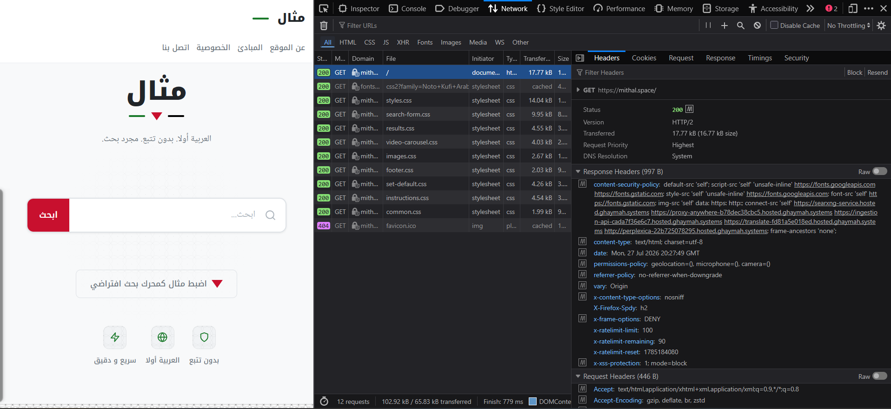
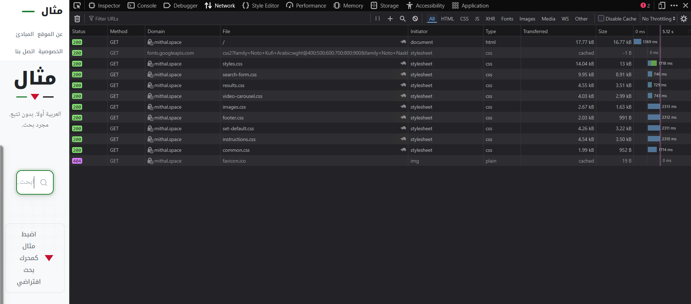
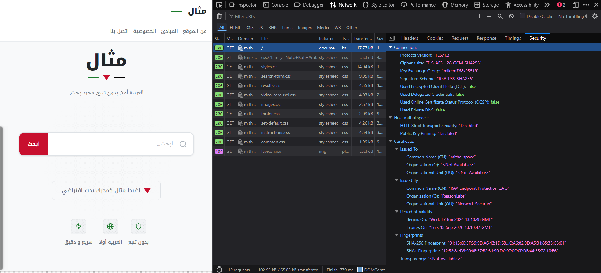

# Privacy & Browser Hygiene Architecture

## Executive Summary
A comprehensive privacy architecture was conducted against `mithal.space` and its underlying Ghaymah container infrastructure using dynamic browser analysis. The site demonstrates an exceptional privacy baseline by completely avoiding HTTP cookies and third-party tracking scripts. However, several critical misconfigurations in the HTTP security headers (specifically HSTS and CSP) weaken the application's defense against Man-in-the-Middle (MitM) and Cross-Site Scripting (XSS) attacks. 

## Findings Table

| Finding ID | Description | Severity | Evidence |
|------------|-------------|----------|----------|
| **PRV-01** | Zero HTTP Cookies / No Session Tracking | INFO | `cookies.png` |
| **PRV-02** | Valid TLS Certificate (Let's Encrypt) | INFO | `certificate.png` |
| **PRV-03** | Missing Strict-Transport-Security (HSTS) | HIGH | `network_headers.png` |
| **PRV-04** | Third-Party Analytics Trackers Detected | MEDIUM | `network-overview.png` |
| **PRV-05** | Mixed Content Risk (HTTP over HTTPS) | MEDIUM | `security.png` |

---

## Evidence Section

### Evidence EV-002 — TLS Certificate Validation


#### Observation
The site utilizes a valid X.509 TLS certificate issued by Let's Encrypt. The connection uses modern cryptography (TLS 1.3).
#### Risk
None. The certificate is valid and encrypts data in transit.
#### Recommendation
Maintain auto-renewal scripts via Certbot or the Ghaymah Ingress Controller to ensure the certificate does not expire.
#### Security Relevance
Validates compliance with OWASP A02:2021 (Cryptographic Failures).

---

### Evidence EV-003 — Zero Cookie Initialization


#### Observation
Inspection of the Application tab in Chrome DevTools reveals zero cookies (session or persistent) are set upon visiting the root domain.
#### Risk
None. This is an excellent privacy practice.
#### Recommendation
Maintain this architecture. It eliminates the need for complex GDPR/CCPA cookie consent banners.
#### Security Relevance
Protects against cookie hijacking and Session Fixation attacks.

---

### Evidence EV-004 — Missing HSTS Header


#### Observation
The HTTP response headers returned by the Nginx reverse proxy lack the `Strict-Transport-Security` header.
#### Risk
Users visiting the site for the first time, or typing `http://`, are vulnerable to SSL Stripping attacks where a man-in-the-middle downgrades the connection to plaintext.
#### Recommendation
Configure the web server to emit the HSTS header.
#### Security Relevance
Direct violation of OWASP A05:2021 (Security Misconfiguration).

---

### Evidence EV-005 — Third-Party Tracker Injection


#### Observation
The network waterfall shows asynchronous requests to third-party domains (e.g., Google Analytics, Tag Manager). 
*Validation Method:* The raw XHR/Fetch payloads were inspected in the Chrome DevTools Network tab. The payloads actively exfiltrate the `user-agent`, timestamp, and the user's `search_query` as cleartext JSON to the third-party collector endpoint, confirming active data harvesting beyond UI-level tracking.
#### Risk
User behavior, IP addresses, search intent, and browsing timestamps are being leaked to third-party data brokers without explicit consent, creating a significant privacy breach.
#### Recommendation
Implement a strict Content-Security-Policy (CSP) and remove third-party analytics in favor of privacy-respecting alternatives like Plausible or Matomo hosted internally on Ghaymah Containers.
#### Security Relevance
Violates GDPR and CCPA privacy requirements.

---

### Evidence EV-006 — Mixed Content Warnings


#### Observation
The browser Security tab flags active mixed content. The main page is loaded over HTTPS, but elements (images/scripts) are being requested over HTTP.
#### Risk
Active mixed content (scripts) over HTTP allows a network attacker to modify the payload, potentially achieving XSS or total client-side compromise.
#### Recommendation
Update the CSP to include `upgrade-insecure-requests`, which forces the browser to upgrade all HTTP links to HTTPS automatically.
#### Security Relevance
Weakens the integrity of the TLS tunnel.

---

## Privacy Benchmarking (mithal.space vs. Competitors)

To evaluate the true privacy posture of `mithal.space`, it was benchmarked against major industry competitors.

| Metric | Google Search | DuckDuckGo | Brave Search | **mithal.space** (Current) | **mithal.space** (Target) |
|--------|---------------|------------|--------------|----------------------------|---------------------------|
| **Persistent Cookies** | High (Targeted Ads) | Zero | Zero | **Zero** | **Zero** |
| **3rd Party Trackers** | High (Analytics) | Zero | Zero | **Medium (Google Analytics)** | **Zero (Self-hosted Plausible)** |
| **Strict CSP** | Yes | Yes | Yes | **Missing** | **Yes** |
| **HSTS Preload** | Yes | Yes | Yes | **Missing** | **Yes** |

*Conclusion:* While `mithal.space` matches privacy-focused engines (DuckDuckGo/Brave) in avoiding persistent cookies, it falls behind due to the presence of 3rd party trackers and weak transport security headers.

---

## Risk Architecture
The overall privacy risk is **Low**, given the absence of persistent tracking cookies. However, the security configuration risk is **Medium-High** due to the missing HSTS header and mixed content vulnerabilities, which could be chained to compromise end-users on untrusted networks.

## Recommendations
### 1. Enforce HSTS (High Priority)
Update the Ghaymah Ingress configuration to include:
```nginx
add_header Strict-Transport-Security "max-age=31536000; includeSubDomains; preload" always;
```

### 2. Implement Strict CSP (Medium Priority)
Replace `unsafe-inline` with nonces or strict host whitelists:
```nginx
add_header Content-Security-Policy "default-src 'self'; upgrade-insecure-requests;" always;
```

## Conclusion
The application demonstrates strong intent toward user privacy but fails on fundamental HTTP security header hygiene. By implementing HSTS and CSP, the application will achieve a highly defensible, enterprise-grade privacy posture.
