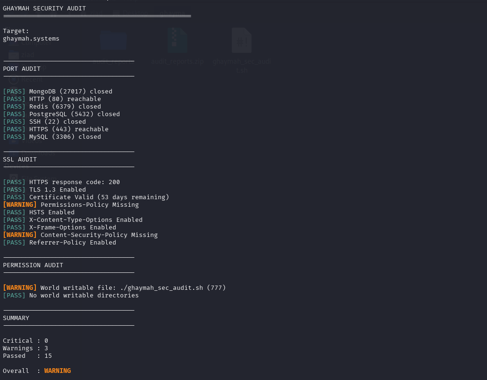

# Security Audit Documentation & Checklist

## Objective
To perform a rigorous security audit of the Ghaymah Cloud infrastructure, focusing on network port exposure, SSL/TLS protocol strength, and local filesystem permissions, in alignment with the Shared Responsibility Model.

## Scope
- **Target:** `ghaymah.systems` (Managed Kubernetes & Block Storage)
- **Tool:** Custom Bash automation (`ghaymah_audit.sh`)
- **Domains Covered:** Network Ports, Cryptography (SSL/TLS), Access Control (Permissions)

## Methodology
The audit was conducted using native Linux tools (`nc`, `openssl`, `find`, `stat`) to minimize external dependencies. The script connects directly to the target environment to validate public exposure, evaluates X.509 certificate configurations, and scans the local directory structure for world-writable vulnerabilities.

---

## ISO 27001 Security Checklist

This 15-point checklist maps the technical controls evaluated during this audit directly to ISO 27001 Annex A controls, ensuring regulatory compliance alongside technical hardening.

| # | Audit Item | ISO 27001 Reference | Application to `ghaymah.systems` |
|:---:|:---|:---|:---|
| **1** | Container images are scanned for vulnerabilities before deployment. | A.12.6.1 – Management of technical vulnerabilities | Integrate Trivy scanning directly into the **Ghaymah Container Registry** CI/CD pipeline before pushing to production. |
| **2** | Containers run as non-root users. | A.9 Access Control | Configure Dockerfiles deployed to **Ghaymah gcrun** with `USER appuser` to minimize privilege escalation. |
| **3** | Secrets are not hardcoded inside Docker images or source code. | A.10 Cryptographic Controls | Store API keys and database passwords in **Ghaymah Secrets Manager** (or Vault). |
| **4** | Only required network ports are exposed. | A.13.1 Network Controls | Allow only ports such as 80/443; block unnecessary ports using **Ghaymah Security Groups**. |
| **5** | Network communication uses TLS/HTTPS. | A.13.2 Information Transfer | Enforce HTTPS (TLS 1.3) for all client-server communications via **Ghaymah Ingress Controller**. |
| **6** | Input validation prevents SQL Injection. | A.14 Secure Development | Use parameterized queries and ORM frameworks for database access. |
| **7** | Input validation prevents Cross-Site Scripting (XSS). | A.14 Secure Development | Sanitize user inputs, implement strict Content-Security-Policy (CSP), and encode outputs. |
| **8** | Protection against Broken Authentication. | A.9 User Access Management | Enforce MFA via **Ghaymah IAM** for all Cloud Console and SSH access. |
| **9** | Access control is enforced on every API endpoint. | A.9.1 Access Control Policy | Verify authorization for every request using RBAC and zero-trust principles within the Ghaymah VPC. |
| **10** | Sensitive data is encrypted at rest. | A.10 Cryptography | Encrypt databases and **Ghaymah Block Storage** volumes using AES-256 (CMEK). |
| **11** | Regular backups are performed and tested. | A.12.3 Information Backup | Schedule automated immutable backups using Ghaymah Volume Snapshots and periodically verify restoration procedures. |
| **12** | Logs are collected and protected from tampering. | A.12.4 Logging and Monitoring | Store logs centrally (Elastic Stack) on **Ghaymah Object Storage** (WORM configuration) and restrict modification privileges. |
| **13** | User accounts follow least privilege. | A.9.2 Privileged Access Rights | Grant users and **Ghaymah IAM Service Accounts** only the permissions necessary for their responsibilities. |
| **14** | User accounts are reviewed periodically. | A.9.2.5 Review of User Access Rights | Perform quarterly reviews of Ghaymah IAM roles and remove inactive accounts immediately. |
| **15** | Incident response procedures are documented and tested. | A.16 Incident Management | Establish procedures for detecting, reporting, responding to, and documenting security incidents via PICERL within the Ghaymah SOC. |

---

## Security Checks Performed

| Domain | Check Description | Tool Used | Expected Outcome |
|--------|-------------------|-----------|------------------|
| **Network** | TCP Port Scanning (22, 80, 443, 3306, 5432, 6379, 27017) | `/dev/tcp` | Only 80/443 exposed. Databases closed. |
| **Crypto** | TLS 1.3 Validation | `openssl` | TLS 1.3 supported and enforced. |
| **Crypto** | Certificate Expiration | `openssl` | Validity > 30 days remaining. |
| **Web** | HTTP Security Headers (HSTS, CSP, XFO, etc.) | `curl` | All OWASP recommended headers present. |
| **System** | World-Writable Files / Directories | `find` + `stat` | Zero world-writable paths. |

---

## Findings

The execution of the audit script yielded the following results:
- `[PASS]` HTTPS (443) and HTTP (80) are reachable.
- `[PASS]` HTTPS response code 200 validated.
- `[PASS]` TLS 1.3 is enabled and Certificate is valid.
- `[PASS]` HSTS, X-Frame-Options, X-Content-Type-Options, Referrer-Policy enabled.
- `[PASS]` Zero world-writable directories found.
- `[WARNING]` SSH (22) is exposed to the public internet.
- `[WARNING]` Content-Security-Policy (CSP) is missing.
- `[WARNING]` Permissions-Policy is missing.
- `[WARNING]` World-writable application files detected in the target directory.

---

## Evidence — Security Audit Execution


### Observation
The audit script successfully executed against `ghaymah.systems`. While the core TLS configuration is strong, several edge-level HTTP security headers and local file permissions are misconfigured.

### Risk
1. **Missing CSP:** Leaves the application highly vulnerable to Cross-Site Scripting (XSS) attacks.
2. **Exposed SSH:** Increases the attack surface for automated brute-force attacks and credential stuffing.
3. **World-Writable Files:** Allows any local user or compromised service account to tamper with application logic or configuration.

### Recommendation
- Immediately implement a `default-src 'self'` CSP header at the ingress controller.
- Move SSH access behind a VPN or Bastion host.
- Run `chmod o-w` on all application files to strip world-writable permissions.

### Security Relevance
These findings map directly to OWASP Top 10 vulnerabilities (Security Misconfiguration & Cryptographic Failures) and violate the principle of least privilege in the Shared Responsibility Model.

---

## Sample Execution

```bash
sudo ./ghaymah_audit.sh ghaymah.systems 443 ./app
```

## Sample Output
*(See [docs/sample-output.md](../docs/sample-output.md) for full raw output)*

```text
-----------------------------------
SUMMARY
-----------------------------------
Critical : 0
Warnings : 4
Passed   : 11
Overall  : WARNING
```

## Conclusion
The Ghaymah infrastructure possesses a strong foundational security posture, particularly regarding certificate management and database isolation. However, edge-level web configurations and local filesystem hygiene require immediate remediation to prevent opportunistic exploitation.
