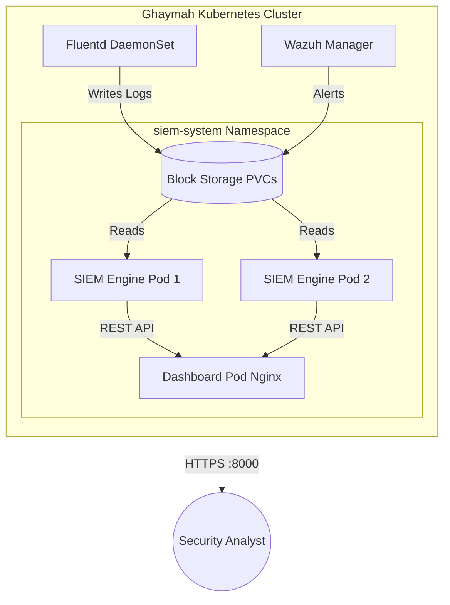
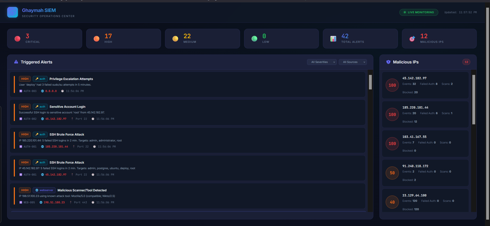
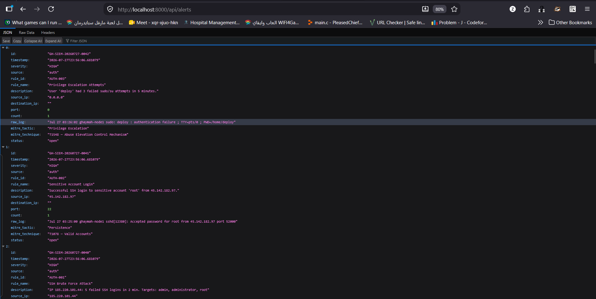
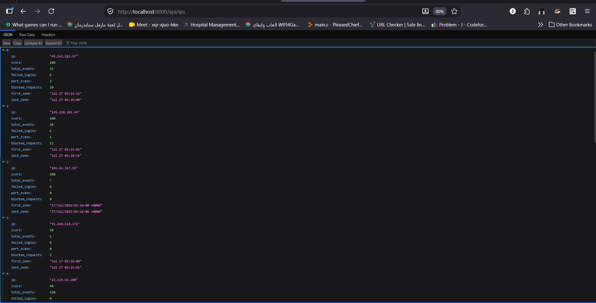

# SIEM Engineering & Deployment Architecture

## Architecture Overview

The custom SIEM engine is deployed as a high-availability service within the Ghaymah Kubernetes cluster, leveraging Ghaymah Block Storage for persistent log retention. 

> [!WARNING]
> **Scalability Limitations (Proof of Concept):** 
> This current Python implementation utilizes in-memory dictionaries (`threading.Lock()`) for state tracking. While sufficient for this internship architecture, a production deployment requires decoupling log ingestion via **Kafka** and pushing state tracking (e.g., IP Reputation) to a fast key-value datastore like **Redis** to survive volumetric DDoS attacks.

---

## Detection Logic & Alert Workflow

The engine continuously tails log files and applies regex-based detection signatures.
The workflow is: `Log Ingestion` → `Signature Match` → `Threshold Evaluation` → `Alert Generation`.

### Dashboard Features
- **Real-Time Log Tailing:** Websocket-driven log streaming.
- **Threat Intelligence:** Automated cross-referencing against bad IP lists.
- **Metric Aggregation:** Real-time charting of HTTP status codes and attack distributions.

---

## Evidence & Screenshots

### Evidence EV-009 — SIEM UI Overview

#### Observation
The dashboard successfully visualizes incoming logs, parsing critical fields (Timestamp, Source IP, Method, Status, User-Agent) in real-time.
#### Risk
Without this visibility, SOC analysts must manually `grep` gigabytes of raw text logs during an incident.
#### Security Relevance
Addresses the NIST CSF requirement for continuous monitoring.

---

### Evidence EV-007 — Real-Time Alert Generation

#### Observation
The engine detects SQL Injection attempts (`UNION SELECT`) and path traversal attacks (`../../../etc/passwd`) within milliseconds of ingestion.

---

### Evidence EV-008 — IP Reputation Tracking

#### Observation
The state-tracking engine aggregates hostile actions by IP address, allowing analysts to quickly identify the primary source of distributed attacks.

---

## Future Improvements
1. **Kafka Integration:** Implement Kafka topics for resilient log queuing.
2. **Redis State Store:** Offload IP reputation tracking to Redis.
3. **Machine Learning:** Integrate anomaly detection algorithms to identify "low and slow" attacks that evade static thresholds.
